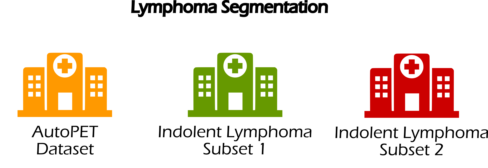

# Federated Lymphoma Segmentation (FedLymphoma)

[](https://hub.docker.com/r/maiacloud/lymphoma-x64-workstation-dgpu-linux-amd64)

This repository provides the necessary tools and instructions to run federated lymphoma segmentation, described in the paper [MONet-FL: Extending nnU-Net with MONAI for Clinical Federated Learning](). 

The Federated training is performed following the tutorial [MONet-FL](https://github.com/SimoneBendazzoli93/MONet-Bundle/blob/main/MONet-FL.ipynb).


In detail, the 2 Lymphoma datasets used in the study are:
- [AutoPET](https://zenodo.org/records/10990932)
- IndolentLymphoma-KUH, private collection of PET-CT of lymphoma patients and corresponding annotations from Karolinska University Hospital, Stockholm, Sweden


Each dataset is assigned to a different site, and the federated training is performed using the [MONet bundle](https://github.com/SimoneBendazzoli93/MONet-Bundle).

## FedLymphoma Inference on PET-CT [DICOM Version]

The input folder should contain all the DICOM files of the study you want to process (with the CT and PT series), and the output folder will contain the lymphoma lesion predictions in DICOM SEG format, and an additional STL file with the 3D mesh of the lymphoma lesion segmentation.


```bash
docker run --rm -it --gpus=all --shm-size 2Gi -v $INPUT_STUDY_FOLDER:/var/holoscan/input -v $PREDICTIONS_FOLDER:/var/holoscan/output maiacloud/lymphoma-x64-workstation-dgpu-linux-amd64:1.0
```

## FedLymphoma Inference on PET-CT [NIFTI Version]

The input folder should contain all the NIfTI files of the study you want to process (one per modality, with the given suffix identifier), and the output folder will contain the predictions in NIfTI format.
The suffix identifiers for the modalities are:
- `_ct.nii.gz` for the CT modality
- `_pet.nii.gz` for the PET modality


```bash
docker run --rm -it --gpus=all --shm-size 2Gi -v $INPUT_STUDY_FOLDER:/var/holoscan/input -v $PREDICTIONS_FOLDER:/var/holoscan/output maiacloud/lymphoma-x64-workstation-dgpu-linux-amd64:1.0-nifti
```

### References

    [1] Ingrisch, M., Dexl, J., Jeblick, K., Cyran, C., Gatidis, S., & Kuestner, T. (2024). Automated Lesion Segmentation in Whole-Body PET/CT - Multitracer Multicenter generalization. 27th International Conference on Medical Image Computing and Computer Assisted Intervention (MICCAI 2024). Zenodo. https://doi.org/10.5281/zenodo.10990932
    [2] Gatidis S, Kuestner T. (2022) A whole-body FDG-PET/CT dataset with manually annotated tumor lesions (FDG-PET-CT-Lesions) [Dataset]. The Cancer Imaging Archive. DOI: 10.7937/gkr0-xv29 